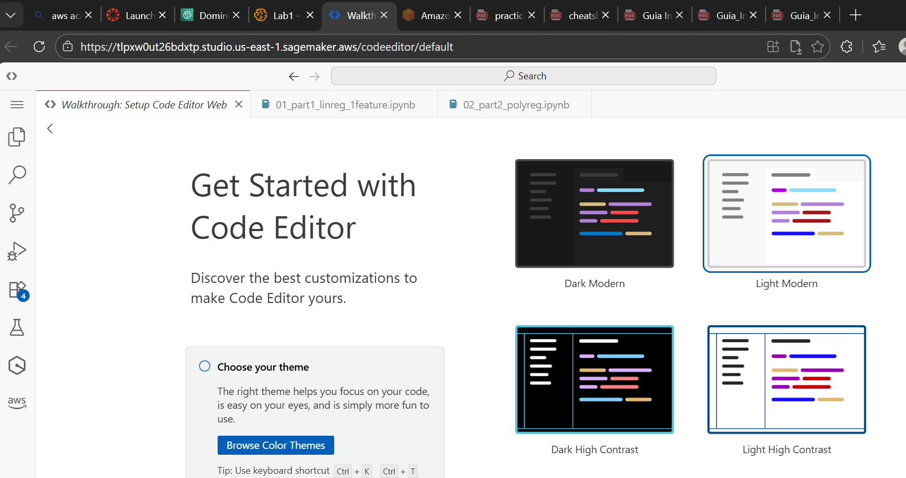
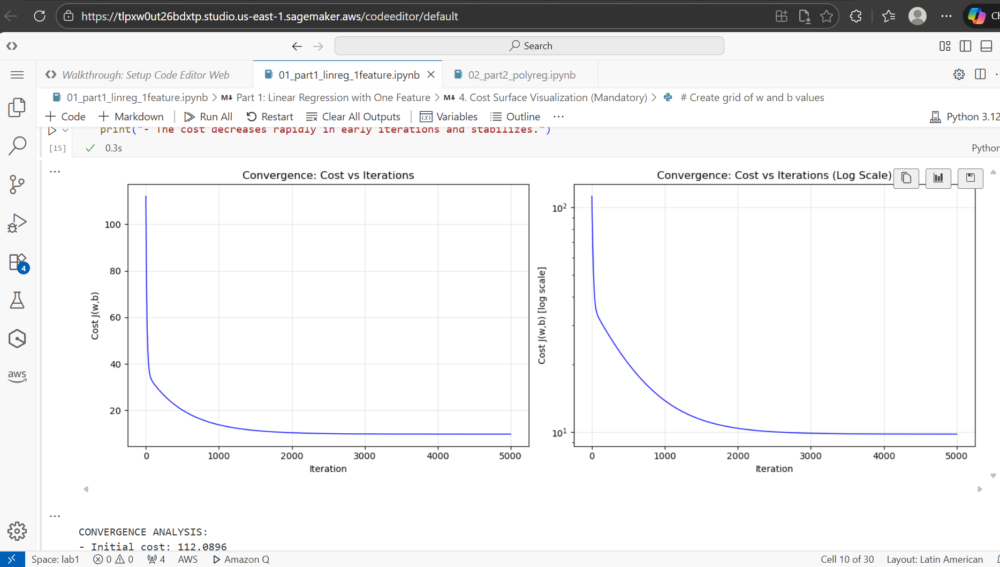
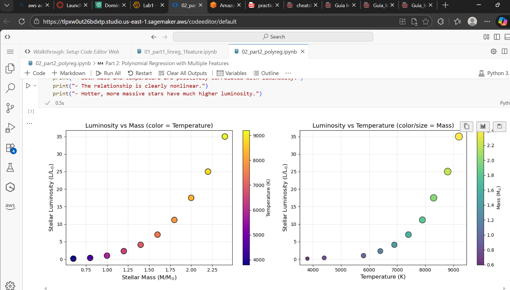

# Stellar Luminosity Regression

Linear and Polynomial Models for Predicting Stellar Luminosity

## Overview

This repository contains implementations of linear and polynomial regression from first principles (without ML libraries) to model the relationship between stellar properties (mass, temperature) and luminosity.

**Course:** AREP 
**Topic:** Regression and Cloud-Ready AI Infrastructure
**Student:** David Felipe Velasquez Contreras


## Repository Structure

```
/
├── README.md                          # This file
├── 01_part1_linreg_1feature.ipynb    # Linear regression with one feature
└── 02_part2_polyreg.ipynb            # Polynomial regression with multiple features
```

## Part 1: Linear Regression (One Feature)

**File:** `01_part1_linreg_1feature.ipynb`

Models stellar luminosity as a function of mass using: `L_hat = w * M + b`

### Contents:
- Dataset visualization (M vs L)
- MSE cost function implementation
- 3D cost surface visualization
- Gradient derivation and implementation (loop and vectorized)
- Gradient descent training
- Convergence analysis
- Learning rate experiments (0.001, 0.01, 0.05, 0.1)
- Residual analysis and systematic errors discussion

### Dataset:
```python
M = [0.6, 0.8, 1.0, 1.2, 1.4, 1.6, 1.8, 2.0, 2.2, 2.4]  # Solar masses
L = [0.15, 0.35, 1.00, 2.30, 4.10, 7.00, 11.2, 17.5, 25.0, 35.0]  # Solar luminosities
```

## Part 2: Polynomial Regression (Multiple Features)

**File:** `02_part2_polyreg.ipynb`

Models luminosity using polynomial features: `L_hat = X @ w + b` where `X = [M, T, M², M*T]`

### Contents:
- Two-feature dataset visualization
- Feature engineering with polynomial and interaction terms
- Vectorized loss and gradient implementation
- Model comparison experiment (M1, M2, M3)
- Interaction term importance analysis
- Inference demo for new star (M=1.3, T=6600)

### Dataset:
```python
M = [0.6, 0.8, 1.0, 1.2, 1.4, 1.6, 1.8, 2.0, 2.2, 2.4]  # Solar masses
T = [3800, 4400, 5800, 6400, 6900, 7400, 7900, 8300, 8800, 9200]  # Kelvin
L = [0.15, 0.35, 1.00, 2.30, 4.10, 7.00, 11.2, 17.5, 25.0, 35.0]  # Solar luminosities
```

## Libraries Used

- **NumPy:** Numerical computations and vectorization
- **Matplotlib:** Data visualization and plotting

**No ML libraries used** (scikit-learn, TensorFlow, etc.)

---

## AWS SageMaker Execution Evidence

### Screenshots

#### 1. Notebooks Visible in SageMaker



#### 2. Successful Execution - Notebook 1



#### 3. Successful Execution - Notebook 2 and Plot Rendered in SageMaker



### Local vs SageMaker Execution Comparison

| Aspect | Local Execution | SageMaker Execution |
|--------|----------------|---------------------|
| Setup | Requires local Python environment | Pre-configured environment |
| Libraries | Manual installation needed | NumPy/Matplotlib pre-installed |
| Compute | Limited to local hardware | Scalable cloud resources |
| Collaboration | File sharing required | Easy notebook sharing |
| Persistence | Local storage | Managed storage |

**Observations:**
- Both environments produced identical numerical results
- Plots rendered correctly in both environments
- SageMaker provided a ready-to-use environment without additional setup
- Execution times were comparable for this small dataset size

## Author

**David Felipe Velasquez Contreras**
ECI - AREP Course
January 2026
